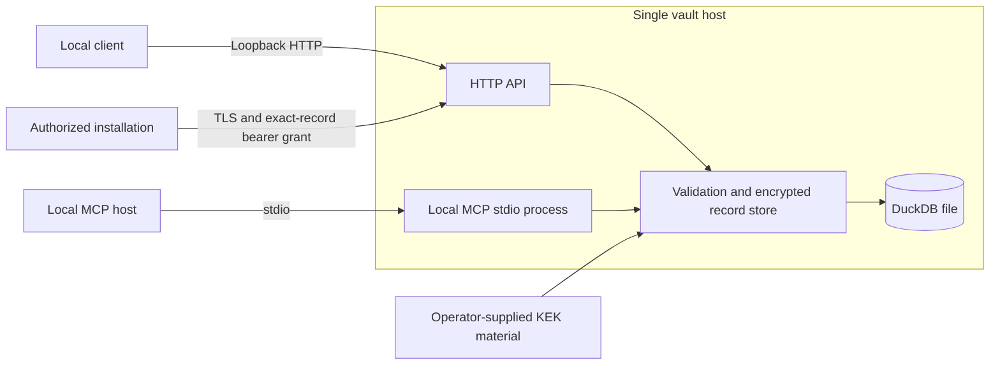
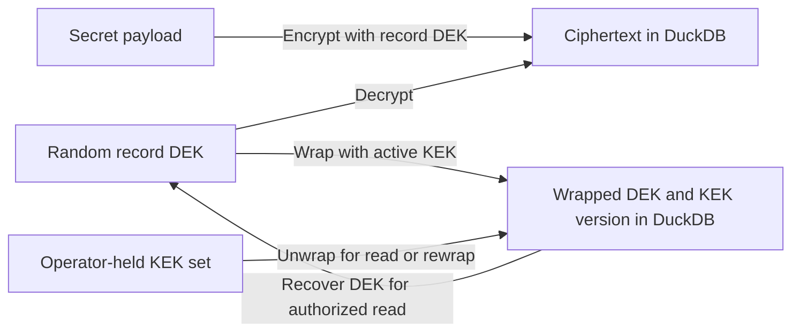

# SquidKeys

SquidKeys is an encrypted credential store for local agents, developer tools, and installations that need to share a narrowly authorized vault. The Go implementation persists records in a local DuckDB file and exposes them through an HTTP API or a local MCP server. Its central design constraint is separation of responsibilities: SquidKeys stores and retrieves credentials; a consuming application decides when and how to use them.

The repository is named `squidkeys`. For compatibility, the Go module remains `github.com/LynnColeArt/squidkeys-go`, and release artifacts retain the `squidkeys-go_` prefix. Renaming the repository does **not** migrate import paths, change the on-disk format, or rename binaries.

## Scope and data model

| Record | Intended contents | Identity |
| --- | --- | --- |
| Authorization | Provider credentials, OAuth-style access/refresh tokens, scopes, and expiry | `agent_id`, provider, account |
| Password | Opaque secret text such as a PAT, passphrase, or private-key blob | `agent_id`, name |
| Certificate | X.509 chain with private key and optional passphrase | `agent_id`, name |
| Git profile | Non-secret Git identity metadata and references to records above | `agent_id`, name |

Git profiles are manifests, not a profile switcher. A separate client may resolve their references and modify Git or SSH configuration. SquidKeys itself does not edit `git config`, rewrite remotes, select an active profile, or materialize secrets on disk. Profile references are validated within the same `agent_id`.

The [API specification](API_SPEC.md) defines record schemas, HTTP routes, MCP tools, and error behavior. The archived [Python implementation](https://github.com/LynnColeArt/SquidKeys-python) remains available for compatibility work; it is not this repository's source of truth.

## Architecture and trust boundaries

The two interfaces serve different trust models. The HTTP server defaults to loopback and can be configured for an opt-in organization policy. The MCP server communicates over local stdio and inherits the trust of the process that launches it; HTTP organization grants do not apply to MCP.



The diagram shows interface boundaries, not a clustered deployment: the current design is a single vault with one active server. Running multiple processes against the same DuckDB file is not an availability strategy. Organization mode does not provision installation identities, distribute tokens, or centralize an entire company's configuration.

### Encryption and rotation

Secret payloads use AES-GCM with a randomly generated data-encryption key (DEK) per record. SquidKeys wraps each DEK under a versioned key-encryption key (KEK). Associated data binds encryption to record identity and key version. The encrypted payload, wrapped DEK, nonces, and key-version metadata are stored in DuckDB; KEK material must be supplied separately at startup.



Rewrapping changes the DEK's KEK envelope and recorded KEK version without asking clients to resubmit plaintext. Keep older KEKs available until all records have been rewrapped and verified; removing a still-required KEK makes those records unreadable. Back up the encrypted database **and** recoverable KEK material through separate, protected channels. A database backup alone is insufficient for restoration.

Encryption at rest does not protect against a compromised vault process, host, KEK source, or authorized client. Record identifiers, Git profile manifests, and operational metadata are not substitutes for encrypted secret fields. An authorized read returns plaintext to its caller. Avoid placing tokens or secret payloads in shell history, process arguments, logs, issue reports, or repository files.

## Build and run

Requirements: Go 1.25.x and a platform supported by `duckdb-go`. The commands below operate from a checkout.

```bash
go build -o bin/squidkeys-api ./cmd/squidkeys-api
go build -o bin/squidkeys-mcp ./cmd/squidkeys-mcp
```

Configure a persistent database path and a 32-byte, URL-safe-base64 KEK. `KEY_STORE_KEKS_JSON` is the preferred versioned configuration; `KEY_STORE_MASTER_KEY` remains available for legacy single-key deployments. Generate key material with a cryptographically secure random source, keep it outside the repository, and inject it through your deployment's secret mechanism.

```bash
export KEY_STORE_DB_PATH="${PWD}/keystore.duckdb"
export KEY_STORE_KEKS_JSON='{"v1":"REPLACE_WITH_BASE64URL_32_BYTE_KEY"}'
export KEY_STORE_ACTIVE_KEK_VERSION='v1'
./bin/squidkeys-api
```

The default HTTP bind is `127.0.0.1:8080`. The default database path, if unset, is `./keystore.duckdb`. The server restricts its database directory to mode `0700` and the file to `0600`. Those permissions complement, but do not replace, host and backup security.

| Setting | Purpose |
| --- | --- |
| `KEY_STORE_DB_PATH` | DuckDB file path |
| `KEY_STORE_KEKS_JSON` | Map of KEK versions to encoded 32-byte keys |
| `KEY_STORE_ACTIVE_KEK_VERSION` | KEK version for new wraps |
| `KEY_STORE_MASTER_KEY` | Legacy single-key alternative |
| `KEY_STORE_API_HOST`, `KEY_STORE_API_PORT` | HTTP bind; defaults to `127.0.0.1:8080` |
| `KEY_STORE_BEARER_TOKEN` | Optional legacy HTTP bearer token for local deployment |
| `KEY_STORE_ORG_AUTH_POLICY_PATH` | Opt-in organization HTTP policy |
| `KEY_STORE_TLS_CERT_FILE`, `KEY_STORE_TLS_KEY_FILE` | TLS identity; required for non-loopback binds |

`KEY_STORE_MCP_TRANSPORT` defaults to `stdio`. Launch `./bin/squidkeys-mcp` from a trusted local MCP host with access to the database and KEK configuration. Do not assume that configuring HTTP authorization also restricts this local process.

### Organization HTTP mode

Set `KEY_STORE_ORG_AUTH_POLICY_PATH` to a version-1 JSON policy to identify separate installations with distinct, high-entropy bearer tokens. Store only the lowercase SHA-256 digest of each token in the policy file. Hashing is appropriate here only because the input tokens are randomly generated and high entropy; human passwords are not suitable substitutes.

```json
{
  "version": 1,
  "principals": [
    {
      "id": "company-admin",
      "token_sha256": "REPLACE_WITH_64_LOWERCASE_HEX_CHARACTERS",
      "admin": true
    },
    {
      "id": "coding-installation",
      "token_sha256": "REPLACE_WITH_ANOTHER_64_LOWERCASE_HEX_DIGEST",
      "read": [
        {"record_type": "password", "agent_id": "coding-installation", "name": "github"},
        {"record_type": "authorization", "agent_id": "coding-installation", "provider": "ollama", "account_id": "production"}
      ]
    }
  ]
}
```

Each reader grant identifies **one exact record**. Reader principals cannot list, write, delete, or manage KEKs; the admin principal can. Authorization grants include `account_id`, even when that value is empty for a default account. The verified principal, not a client-supplied actor name, is used for organization-mode audit attribution. Missing credentials produce HTTP 401 and denied grants produce HTTP 403. `/health` is unauthenticated and returns no vault contents.

Policies are loaded at startup: grant changes and revocations require an API restart. Keep the policy and admin token protected separately. Organization mode cannot be combined with `KEY_STORE_BEARER_TOKEN`. A non-loopback HTTP bind is refused unless **both** an organization policy and TLS certificate/key are configured. Clients must validate the server certificate. Do not expose legacy single-token or unauthenticated mode to a network.

## Interfaces and operations

The HTTP API supports create/read/delete operations for authorizations, passwords, certificates, and Git profiles, plus key status and rewrap operations. The MCP server offers corresponding tools, including `save_*`, `get_*`, and `delete_*` operations, profile listing, `key_status`, and `rewrap_all_records`. See [API_SPEC.md](API_SPEC.md) for exact request bodies, paths, and responses.

Certificate support covers PEM X.509 chains with unencrypted or legacy PEM-encrypted private-key blocks. PKCS#12/PFX and PKCS#8 `ENCRYPTED PRIVATE KEY` are not supported. Authorization expiry values require RFC 3339 timestamps with an explicit offset or `Z`.

Operationally, treat the database, KEKs, tokens, and policy as distinct assets:

1. Provision a private database location and KEK source before starting either interface.
2. In organization mode, issue a different random token to each installation and grant only required record reads.
3. Verify client TLS trust and authorization before placing the API on a non-loopback interface.
4. Back up and test recovery of both encrypted data and KEK material; retain old KEKs during a rewrap migration.
5. Restart the API after policy changes and verify revoked clients are denied.

Audit events are stored in the vault database, so a database compromise or loss also affects audit evidence. SquidKeys is not a hardened external audit service, clustered secret manager, or automatic token-provisioning system.

## Releases and compatibility

The release helper builds both binaries and packages `README.md` and `API_SPEC.md`. Archive names intentionally retain the historical `squidkeys-go_` prefix. For example, a published v0.2.0 Linux/amd64 archive would be located at:

```text
https://github.com/LynnColeArt/squidkeys/releases/download/v0.2.0/squidkeys-go_0.2.0_linux_amd64.tar.gz
```

Build a package for the current platform with `./scripts/build-release.sh`, or set `SQUIDKEYS_RELEASE_TARGETS` to a space-separated `GOOS/GOARCH` matrix. `SQUIDKEYS_RELEASE_DIR` changes the output directory (default: `dist/`). Publishing a release and attaching archives is a separate operation; the URL above is an archive naming example, not a guarantee that an asset has been published.

The Go module path is intentionally still `github.com/LynnColeArt/squidkeys-go`. Existing consumers can continue to import it while GitHub redirects the former repository URL. A future module-path migration would require a coordinated major compatibility decision; this repository rename does not imply one. The Python compatibility harness now resolves the archived source explicitly from `SquidKeys-python` rather than relying on the old redirect.

## Verification

```bash
go test ./...
go test -race ./...
go vet ./...
./scripts/run-python-compat.sh
```

The Python harness checks cross-implementation reads, writes, and rewraps for the original authorization/password format. It downloads the archived Python repository if `SQUIDKEYS_PYTHON_SOURCE` is not set; it also creates a local virtual environment and installs Python test dependencies. CI runs the Go test suite, race detector, vet, and a release-packaging smoke test. See [`.github/workflows/ci.yml`](.github/workflows/ci.yml).
